# 매니저 시스템 흐름도

## 📋 개요

"Did You Hear?" 프로젝트의 매니저 시스템 전체 흐름과 각 컴포넌트 간의 상호작용을 시각화한 문서입니다.

## 🏗️ 시스템 아키텍처 흐름도

### 전체 시스템 구조

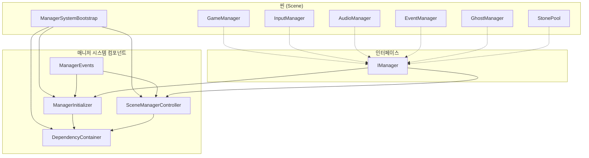

## 🚀 초기화 흐름도

### 1단계: 부트스트랩 초기화

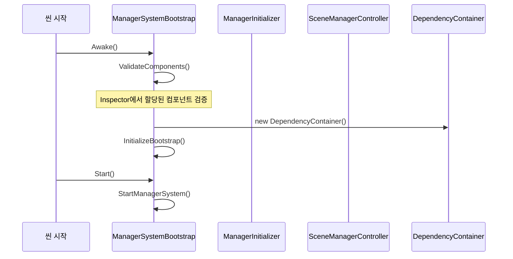

### 2단계: 매니저 등록 및 초기화

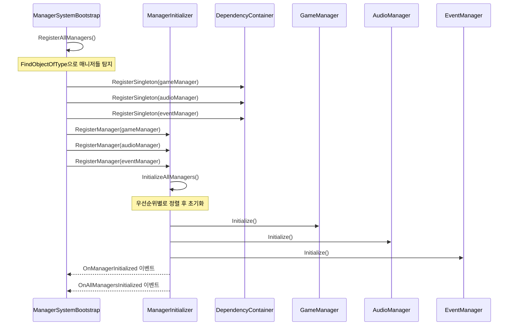

## 🎯 매니저 우선순위 흐름도

### 초기화 순서

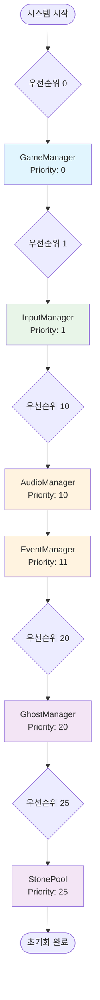

## 🎬 씬별 매니저 관리 흐름도

### 씬 전환 시 매니저 활성화/비활성화

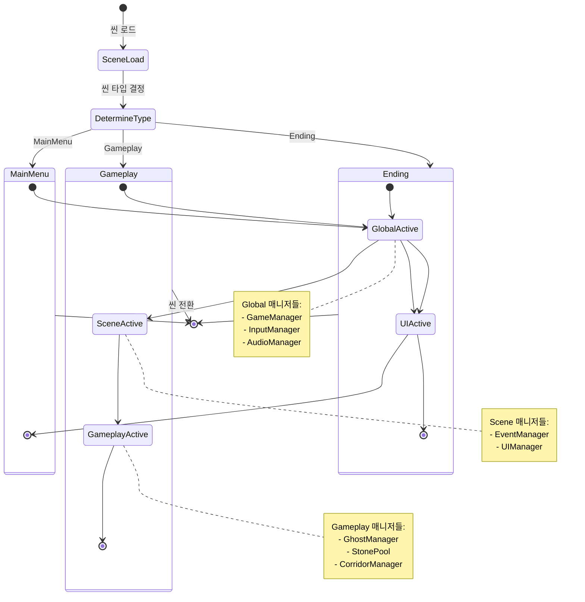

## 🔄 의존성 주입 흐름도

### DependencyContainer 동작 방식

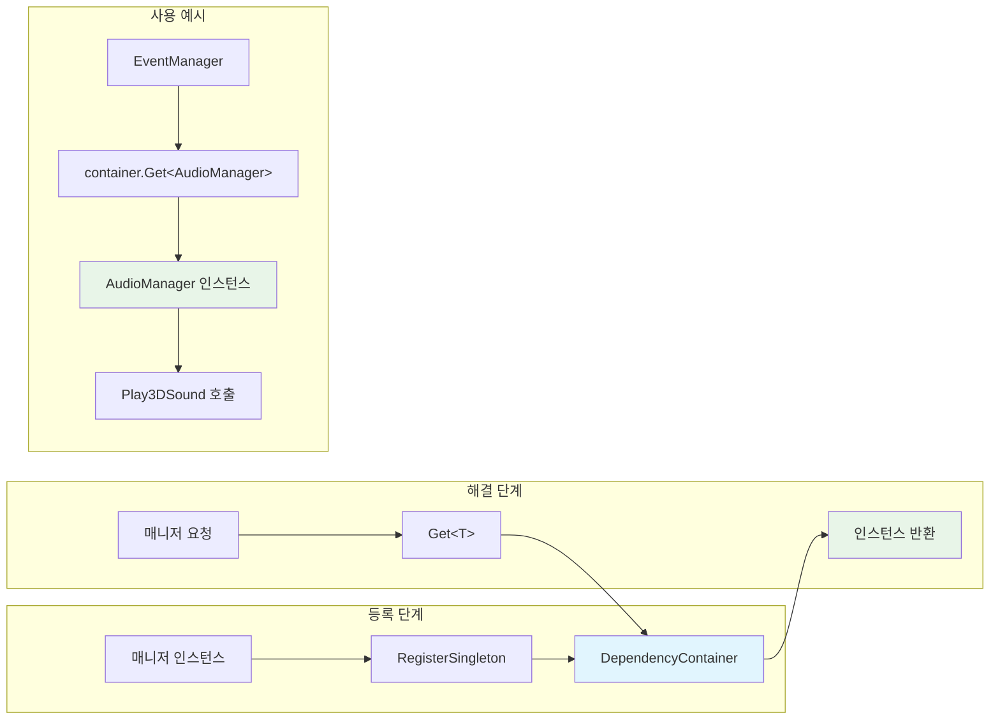

## 📡 이벤트 기반 통신 흐름도

### ManagerEvents를 통한 매니저 간 통신

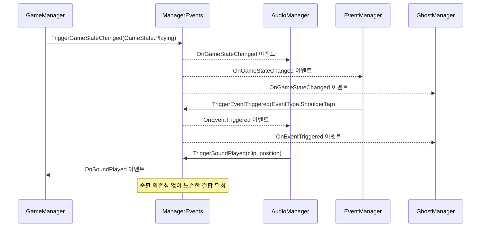

## 🎮 게임플레이 중 매니저 상호작용 흐름도

### 실제 게임 상황에서의 매니저 동작

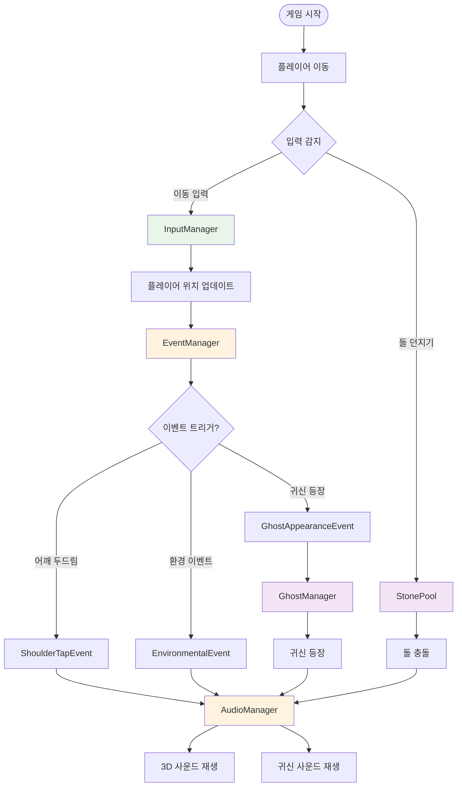

## 🛠️ 에러 처리 및 복구 흐름도

### 초기화 실패 시 처리

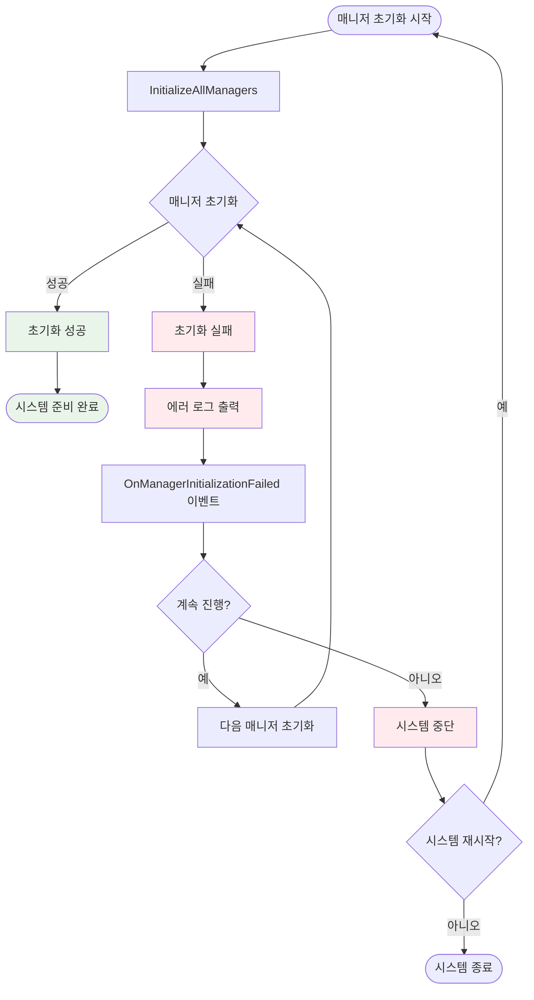

## 📊 시스템 상태 모니터링 흐름도

### LogSystemStatus 동작

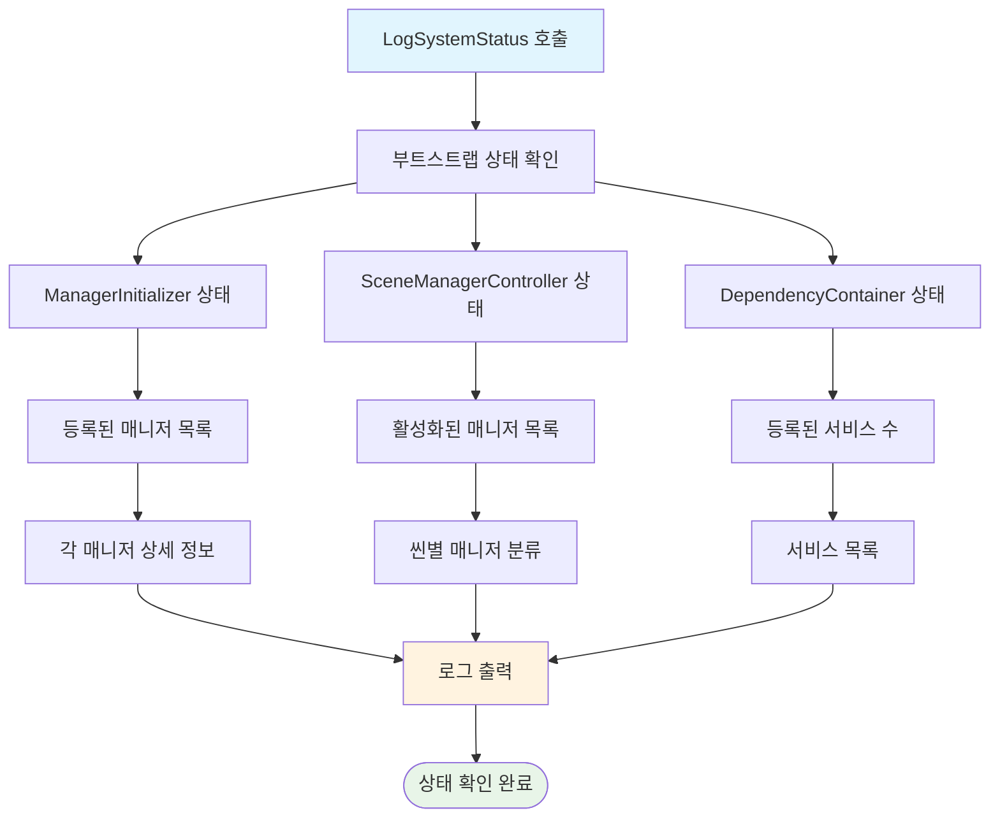

## 🔧 시스템 재시작 흐름도

### RestartManagerSystem 동작

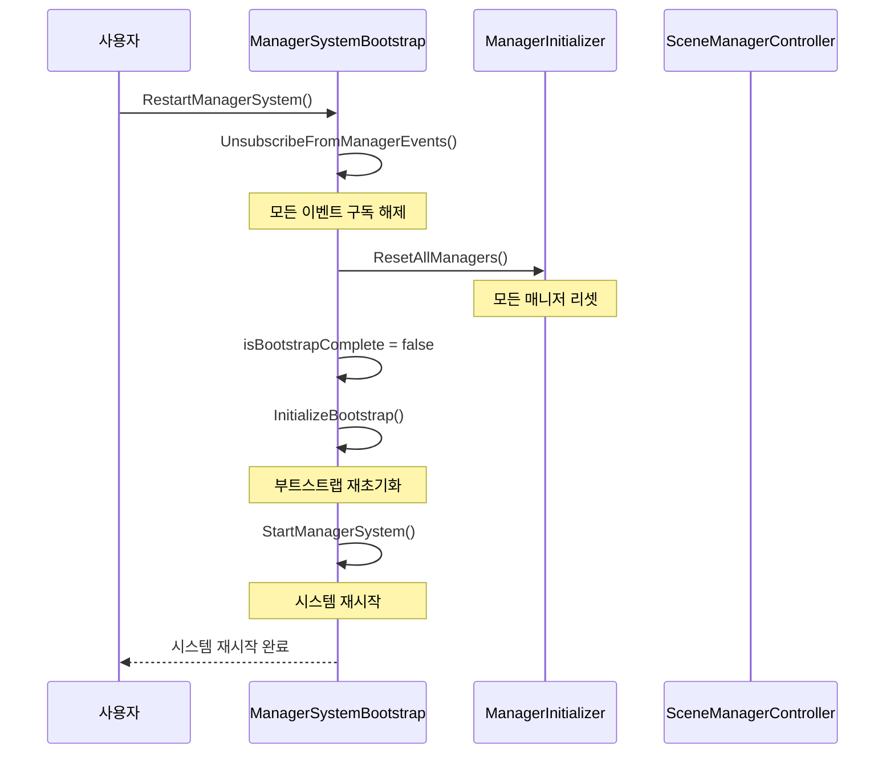

## 📝 주요 특징 요약

### ✅ 장점
- **명확한 초기화 순서**: 우선순위 기반 초기화
- **씬별 매니저 관리**: 메모리 효율성 향상
- **의존성 주입**: 느슨한 결합 달성
- **이벤트 기반 통신**: 순환 의존성 제거
- **에러 처리**: 견고한 시스템 설계

### 🎯 핵심 컴포넌트
1. **ManagerSystemBootstrap**: 시스템 진입점 및 조율자
2. **ManagerInitializer**: 우선순위 기반 초기화 관리
3. **SceneManagerController**: 씬별 매니저 활성화 관리
4. **DependencyContainer**: 의존성 주입 컨테이너
5. **ManagerEvents**: 이벤트 기반 통신 시스템

이 흐름도를 통해 매니저 시스템의 전체적인 동작 방식과 각 컴포넌트 간의 상호작용을 이해할 수 있습니다.
